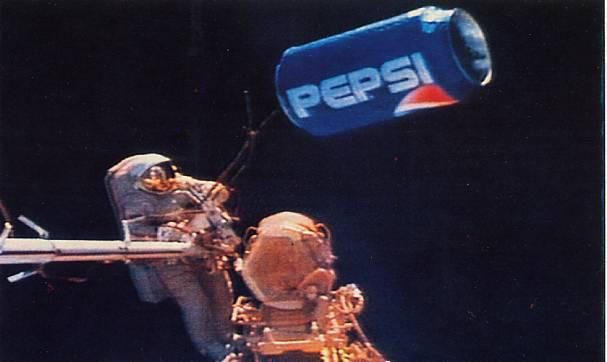

 
  

<h1 align="center"> International Pepsi Station </h1>
<h3 align="center"> Epicodus - January PT Cohort </h3>
<h5 align="center"> ReactJS First Assignment  </h5>

This ReactJS application that will allow a user to manage and keep track of pepsi products. The application allows full CRUD functionality and includes a special button to keep track of sales and profits.  The project demonstrates functional programming and utilizes an approach that avoids mutating the state. It also shows how ReactJS can be utilize reusable components to reduce redundant code.

## Technologies Used

* Git
* React
* Javascript
* WebPack
* CSS
* HTML
* Gh-Pages

## Component Diagram

## Known Bugs

* There are currently no known bugs

## Setup/Installation Requirements

* _Requires Visual Studio Code Installation_
* _Requires Terminal Installation_
* _Open the terminal on your local machine_
* _Navigate to the directory inside of which you wish to house this project_
* _Clone this project with the following command  `$ git clone https://github.com/FaisalRana/ReactJsTheBubbleRoom.git`_
* _Navigate to the root directory by entering `$ cd thebubbleroom`_
* _Open this project in Visual Studio Code with the command `$ code .`_
* _Retrieve and install packages needed to run this application with `$ npm install`_
* _Run the application in development mode with `$ npm run start`_
* _Open [http://localhost:3000](http://localhost:3000) to view it in the browser_

### License

[]

## Contact Information:

<h5>Faisal Rana</h5>

